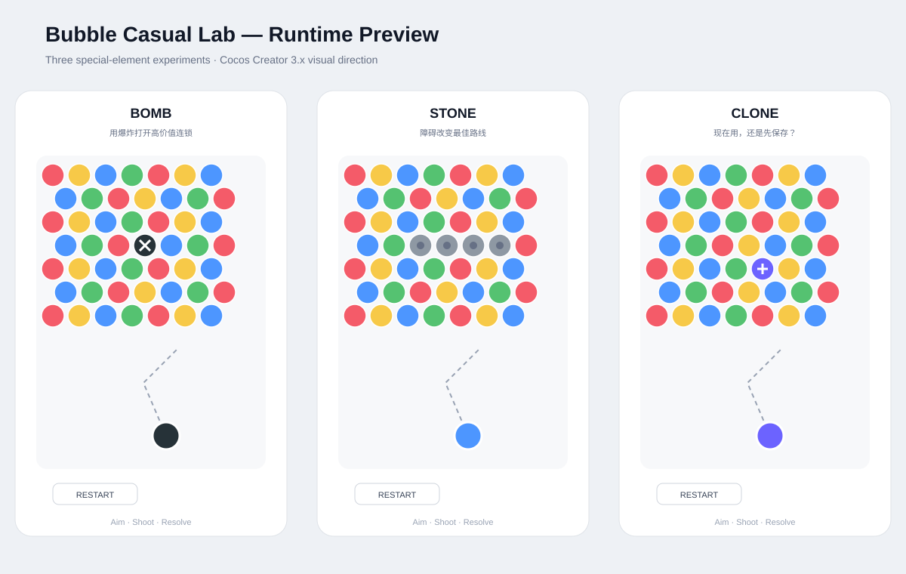

# Bubble Casual Lab

一个面向**休闲游戏策划 / 关卡设计作品集**的 Cocos Creator 3.x 实验项目。

核心目标不是做一个“大而全”的泡泡龙，而是验证三个特殊元素能否产生不同的**玩家决策**：

- **Bomb**：爆发型决策——“这一发炸在哪里最赚？”
- **Stone**：路线型决策——“哪条射击路线值得走？”
- **Clone**：规划型决策——“现在用，还是先保存？”

## 游戏界面

> 当前展示图按项目运行时 UI 与棋盘规则制作，用于 GitHub 首页展示核心玩法、特殊元素和交互布局。

## 当前版本

**Spiral Iteration 10 / 10 — stopped**

这十次迭代围绕“从能演示 → 能玩 → 能解释 → 能作为作品集”逐步收敛：

1. 重构射击与棋盘状态模型
2. 引入错列六边形邻接
3. 完成碰撞后的确定性落点
4. 区分 Bomb / Stone / Clone 的设计决策
5. 增加作品集视觉展示
6. 引入数据驱动关卡结构
7. 设计 10 关递进式难度
8. 建立人工 QA 清单
9. 收敛作品集叙事
10. README 加入游戏界面展示并停止扩张

## 核心玩法

`Aim → Shoot → Attach → Resolve → Match/Drop → Next Shot`

- 普通球：三连消除
- Bomb：局部范围爆破，追求高价值连锁
- Stone：不可消除障碍，改变路线
- Clone：复制附近颜色，可选择 HOLD 延后使用
- Unsupported Drop：顶部不连通的普通球会掉落
- Score / Combo：用于验证玩家是否因为特殊元素获得更高收益

## 技术

- Cocos Creator 3.x
- TypeScript
- Cocos Graphics / Label
- 运行时生成棋盘与 UI
- 不依赖外部美术资源即可运行核心原型

## 运行

1. 安装 Cocos Creator 3.x
2. 打开本仓库
3. 创建 2D Scene
4. 创建空 Node，例如 `BubbleGame`
5. 挂载 `assets/scripts/BubbleGame.ts`
6. 运行 Scene

完整步骤见 [SETUP.md](SETUP.md)。

## 关卡设计

10 个关卡定义在 `assets/levels/levels.json`，从单一特殊元素逐步过渡到路线、爆发、克隆与组合决策。

设计原则见：

- [docs/LEVEL_DESIGN.md](docs/LEVEL_DESIGN.md)
- [docs/GAMEPLAY.md](docs/GAMEPLAY.md)
- [docs/PORTFOLIO.md](docs/PORTFOLIO.md)
- [docs/ITERATION_LOG.md](docs/ITERATION_LOG.md)
- [docs/TEST_PLAN.md](docs/TEST_PLAN.md)

## 作品集定位

这个项目重点展示的是：

> **我不仅会实现一个休闲游戏原型，还能从“特殊元素 → 玩家决策 → 关卡摆放 → 反馈 → 难度曲线”完整地思考一个休闲游戏策划问题。**

当前十轮迭代到此停止。后续如果继续开发，应以真实试玩数据验证设计，而不是无止境增加功能。
